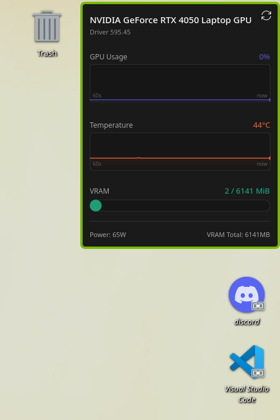
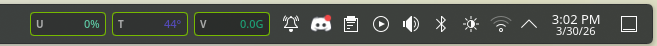

# KDE GPU Tracker Widget


A sleek, high-performance KDE Plasma 6 widget designed for **NVIDIA** and **AMD** users. It provides real-time monitoring of your GPU directly from your desktop or your system tray with a native look and feel.

---

## Preview

| Full Desktop View  | Compact Panel View  |
|----------------------------|---------------------------------------|
|  |  |
---

## ✨ Features

* **Smart Hardware Detection**: Automatically switches between nvidia-smi, rocm-smi, or sysfs (AMD) based on your active GPU.
* **Dual-Mode Interface**: 
    * **Full Representation**: Detailed Sparklines for Usage & Temp, VRAM bar, and Driver version.
    * **Compact Representation**: Minimalist tiles for your panel showing **U** (Usage), **T** (Temp), and **V** (VRAM).
* **Responsive Design**: Elements automatically hide/resize to fit your widget's dimensions.
* **Optimized for CachyOS**: Ultra-low overhead, built with Qt 6 and native Plasma 6 components.

---

## 🛠 Prerequisites

Ensure you have the following tools installed based on your GPU brand:

### 🟢 NVIDIA
- nvidia-utils (provides nvidia-smi)
- Proprietary NVIDIA drivers installed and working.

### 🔴 AMD
- rocm-smi-lib (for advanced monitoring via rocm-smi)
- *OR* Standard kernel drivers (uses sysfs as a fallback for usage/temp).

---

## Installation & Setup

### 1. Clone the repository
```bash
git clone https://github.com/xsvmyx/kde-gputracker-widget.git
cd kde-gputracker-widget
```

### 2. Install the widget
Use the Plasma 6 package tool to install it for your user:
```bash
kpackagetool6 -t Plasma/Applet -i .
```

### 3. Add to your Desktop/Panel
1. Right-click on your desktop or panel.
2. Select **"Add Widgets..."** (Ajouter des composants graphiques).
3. Search for **"xsvmyx GPU Tracker"**.
4. Drag and drop it onto your desktop or into your taskbar!

### **Note**: If the widget doesn't appear in the list immediately, you can refresh the plasma shell with:
```bash
plasmashell --replace & disown
```
---

## 🔄 How to Update or Uninstall

### To update:
If you pull the latest changes from this repo, update the installed widget with:
```bash
kpackagetool6 -t Plasma/Applet -u .
```
### To uninstall:

```bash
kpackagetool6 -t Plasma/Applet -r org.kde.plasma.gputracker
```

---

## License
MIT License - Feel free to fork, modify, and improve!

**Developed by [xsvmyx](https://github.com/xsvmyx)**